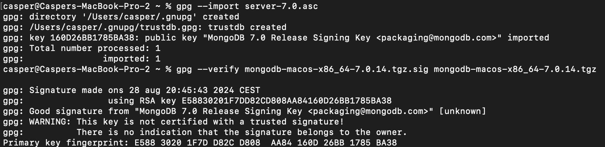
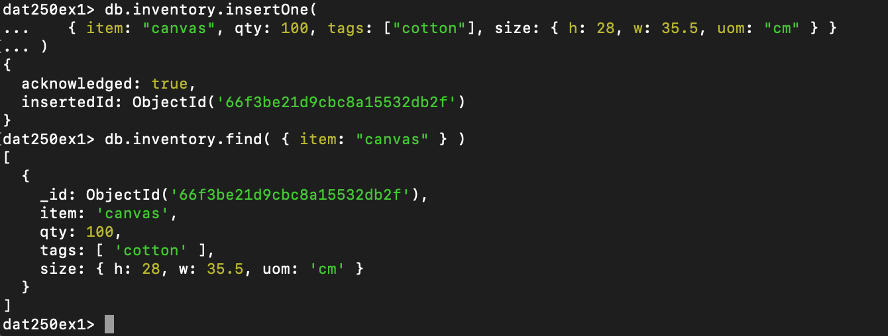
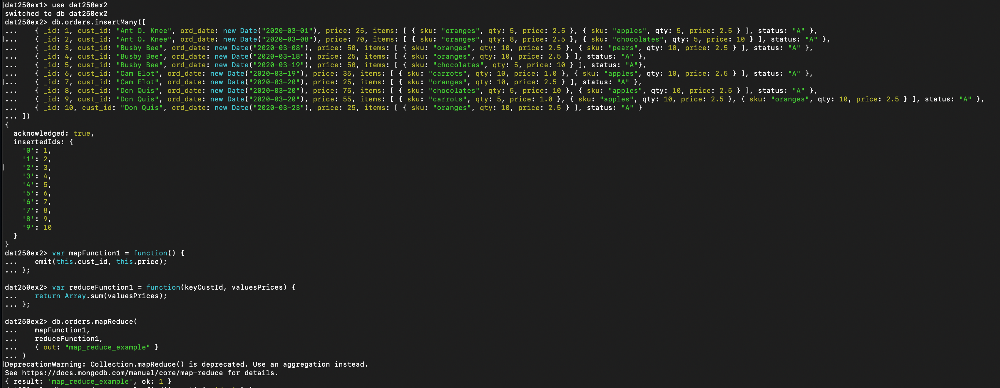
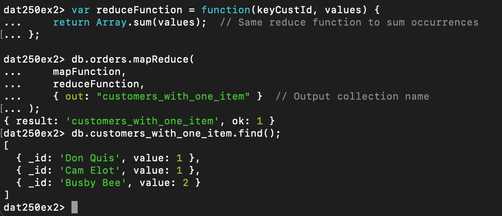

## Expass 5


```
casper@Caspers-MacBook-Pro-2 ~ % gpg --import server-7.0.asc
gpg: directory '/Users/casper/.gnupg' created
gpg: /Users/casper/.gnupg/trustdb.gpg: trustdb created
gpg: key 160D26BB1785BA38: public key "MongoDB 7.0 Release Signing Key <packaging@mongodb.com>" imported
gpg: Total number processed: 1
gpg:               imported: 1
casper@Caspers-MacBook-Pro-2 ~ % 

```
## Verification:


<br>
## CRUD operation:



## Example 1:


```
dat250ex2> db.map_reduce_example.find().sort( { _id: 1 } )
[
  { _id: 'Ant O. Knee', value: 95 },
  { _id: 'Busby Bee', value: 125 },
  { _id: 'Cam Elot', value: 60 },
  { _id: 'Don Quis', value: 155 }
]
dat250ex2> 
```
<br>

## Example 2:


## own example




## Technical issues.

I had some issues regarding ATlas ui, so I dropped using it and just used the terminal. 